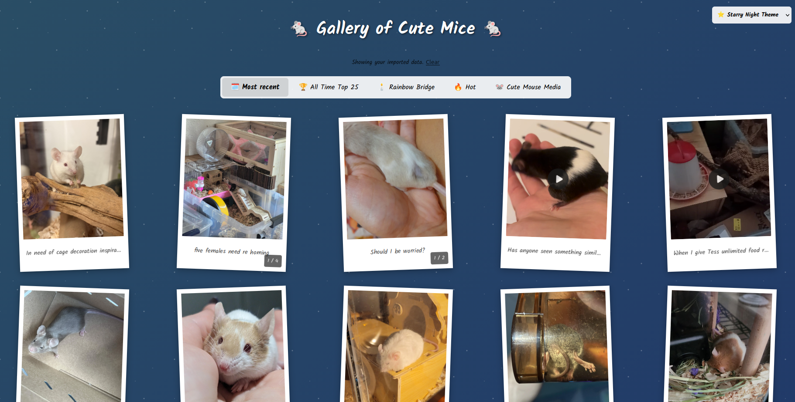

# 🐭 Pet Mice Gallery - React + Vite + TypeScript

A gallery displaying the lovely mice from the `r/PetMice` subreddit.
You can find the deployed version on Github [here](https://littlemousey.github.io/petmice-remix/)
In case there are CORS problems with Reddit, you can always run the app locally. You can find instructions below.
If you don't want to install Node and NPM on your computer, the original/initial version built with basic HTML, JavaScript and CSS can be found [here](https://github.com/littlemousey/petmice-subreddit)
Of course you are free to alter/change the code to your liking.

## How to install the app locally

I would recommend installing the latest NodeJS version [here](https://nodejs.org/en/download).
Download the files with [Git](https://git-scm.com/install/) from Github
Open the folder `petmice-remix` and launch a terminal. Run the following commands:

- `npm install`
- `npm run dev`

You should see in the terminal which port is used for the app. You can copy paste that location to your browser url. For example: `http://localhost:5173/petmice-remix/`

When you want to terminate the app, just press the buttons `ctrl` and `c`

## 🎨 Themes

Five themes are available and your preference is saved in localStorage:

- 🌈 **Rainbow** (default) — vibrant rainbow gradient with rotated polaroid frames
- 🎄 **Christmas** — deep red background with animated snowfall and gold accents
- ⭐ **Starry Night** — dark night sky with stars
- ☁️ **Blue Sky** — bright sky with floating clouds
- 💕 **Hearts** — soft pastel background with hearts

## 📥 Reddit data

Reddit's API blocks requests from unauthenticated users, so the app falls back to bundled local data when the live fetch fails. That fallback data is **outdated** — to see fresh posts, use the **Import Data** button in the app:

1. Open the Reddit JSON URL shown in the dialog while logged in to Reddit
2. Copy the raw JSON from your browser
3. Paste it into the dialog (or save it as a `.json` file and upload it)

The gallery will load immediately from the data you provide.

## 🙏 Credits

- Mouse images from [r/PetMice](https://reddit.com/r/PetMice)
- Built with [Vite](https://vite.dev/), [React](https://react.dev/), and [Tailwind CSS](https://tailwindcss.com/)
- Font: [Edu NSW ACT Cursive](https://fonts.google.com/specimen/Edu+NSW+ACT+Foundation)
- Song from [Pixabay](https://pixabay.com/sound-effects/christmas-is-christmas-loop-3-melody-without-drums-409042/)

## 📄 License: MIT

You can use this application and the code however you want

---

Made for mouse lovers 🐭 by little mousey ❤️
